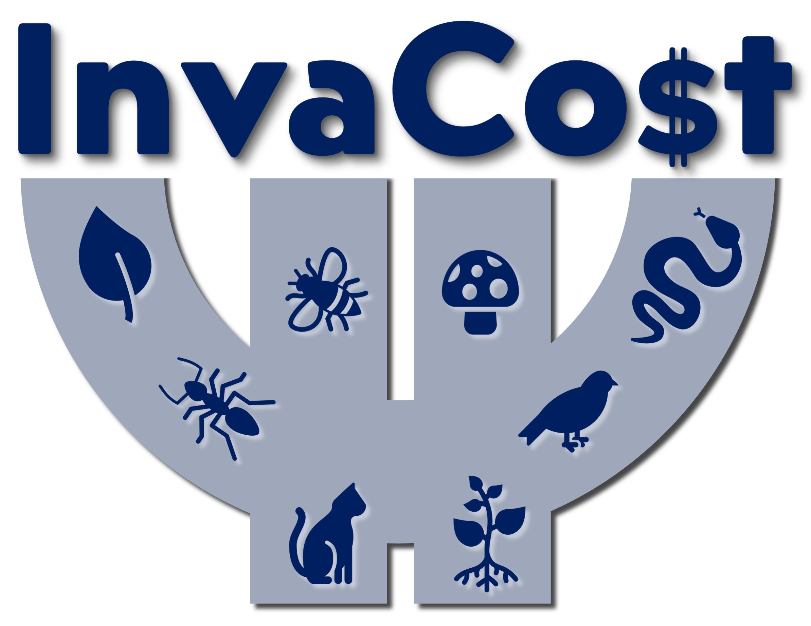

# Economic costs of non-native species in Türkiye: A first national synthesis
## Leader: <a href="https://www.mu.edu.tr/tr/personel/serhan">Ali Serhan Tarkan</a>
### Mugla Sıtkı Kocman University

<strong>Authors</strong>:
Ali Serhan Tarkan1,2,3,*, Esra Bayçelebi4, Daniela Giannetto5, Emine Demir Özden6, Ayşe Yazlık6, Özgür Emiroğlu7, Sadi Aksu8, Ahmet Uludağ9, Necmi Aksoy10, Hazel Baytaşoğlu4, Cüneyt Kaya4, Tanju Mutlu11, Şerife Gülsün Kırankaya12, Deniz Ergüden13, Esra Per14, İlhan Üremiş15, Onur Candan16, Aysel Kekillioğlu17, Baran Yoğurtçuoğlu18, F. Güler Ekmekçi18, Esra Başak19, Hatice Özkan20, Irmak Kurtul3,21, Deniz Innal22, Nurçin Killi1, Sercan Yapıcı1, Dinçer Ayaz23, Kerim Çiçek23,24, Oğuzcan Mol7, Emre Çınar7, Vedat Yeğen25, Elena Angulo26, Ross N. Cuthbert27, Ismael Soto28, Franck Courchamp29, †, Phillip J. Haubrock28, 30,31,
## Abstract
Biological invasions are increasingly recognised as a major global change that erodes ecosystems, societal well-being, and economies. However, comprehensive analyses of their economic ramifications are missing for most national economies, despite rapidly escalating costs globally. Türkiye is highly vulnerable to biological invasions owing to its extensive transport network and trade connections as well as its unique transcontinental position at the interface of Europe and Asia. This study presents the first analysis of the reported economic costs caused by biological invasions in Türkiye. The InvaCost database which compiles invasive non-native species’ monetary costs was used, complemented with cost searches specific to Türkiye, to describe the spatial and taxonomic attributes of costly invasive non-native species, the types of costs, and their temporal trends. The total economic cost attributed to invasive non-native species in Türkiye (from 202 cost reporting documents) amounted to US$ 4.1 billion from 1960 to 2022. However, cost data were only available for 87 out of 872 (10%) non-native species known for Türkiye. Costs were biassed towards a few hyper-costly non-native taxa, such as jellyfish, stink bugs, and locusts. Among impacted sectors, agriculture bore the highest total cost, reaching US$ 2.85 billion, followed by the fishery sector with a total cost of US$ 1.20 billion. Management (i.e., control and eradication) costs were, against expectations, substantially higher than reported damage costs (US$ 2.89 billion vs. US$ 28.4 million). Yearly costs incurred by non-native species rose exponentially over time, reaching US$ 504 million per year in 2020-2022 and are predicted to increase further in the next 5-10 years. A large deficit of cost records compared to other countries was also shown, suggesting a larger monetary underestimate than is typically observed. These findings underscore the need for improved cost recording as well as preventative management strategies to reduce future post-invasion management costs and help inform decisions to manage the economic burdens posed by invasive non-native species. These insights further emphasise the crucial role of standardised data in accurately estimating the costs associated with invasive non-native species for prioritisation and communication purposes.

**Keywords**: damages and losses, economic impact, InvaCost, biological invasions, invasive species, conservation policy, Turkey

## <a href="https://github.com/IsmaSA/Aquaculture/tree/master/Code">Script:</a>
Code created by: <a href="https://www.researchgate.net/profile/Ismael-Soto-4">Ismael Soto</a>   

[][mail] 

[mail]: mailto:isma-sa@hotmail.com

Reproducible code:
- <code>R_code.R</code>

